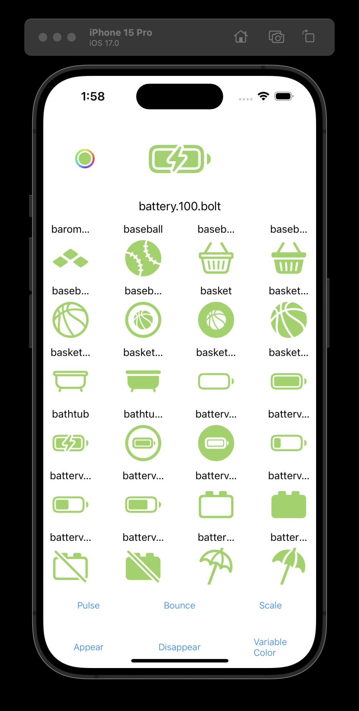
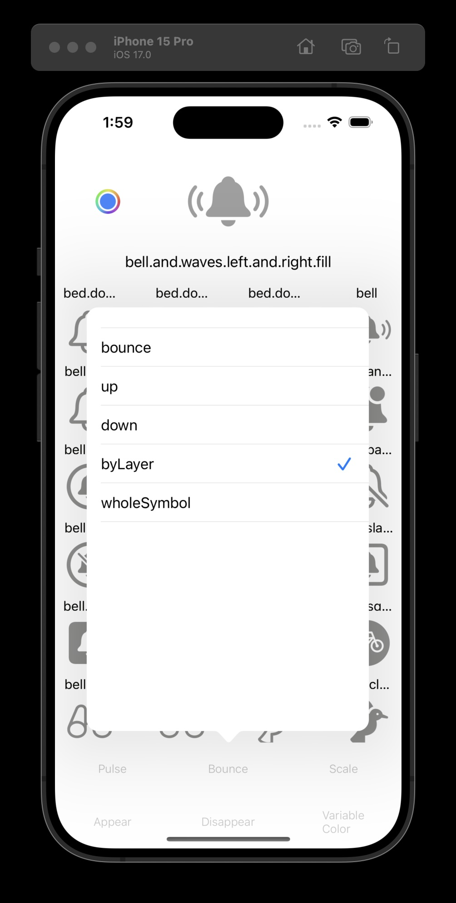

# SF Symbols Viewer App

The SF Symbols Viewer is a user-friendly application that allows you to explore and interact with Apple's SF Symbols library. SF Symbols is a set of over 5,000 icons and symbols that are designed to work seamlessly with Apple's user interface frameworks. With this app, you can effortlessly browse, select, and preview SF Symbols, customize their appearance, and even view animated versions.

## Features

- **Symbol Library**: Browse and search through Apple's extensive SF Symbols library with ease. The app provides a comprehensive collection of icons, making it simple to find the symbol you need.

- **Symbol Customization**: Customize the appearance of SF Symbols by selecting a color. This feature enables you to see how a symbol looks in various color schemes, helping you choose the perfect match for your application or project.

- **Symbol Animation**: View animated versions of symbols to better understand how they might look in action. Experiment with different animations to see which one suits your needs.

## Getting Started

### Installation

1. Clone this repository to your local machine.

   
`   git clone https://github.com/MaorS/SF-Symbols-animations.git`

2. Open the project in Xcode.

3. Build and run the project on your Mac.

## Usage

1. Launch the SF Symbols Viewer app.

2. Browse for the symbol you want to explore.

3. To customize the symbol's color, select a color from the color picker.

4. To view animated versions of the symbol, choose from the available animations.

5. Enjoy exploring and experimenting with SF Symbols!

## Contributing

If you'd like to contribute to this project, feel free to open an issue, submit a pull request, or provide feedback. We appreciate your input!

